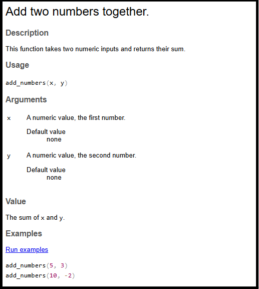
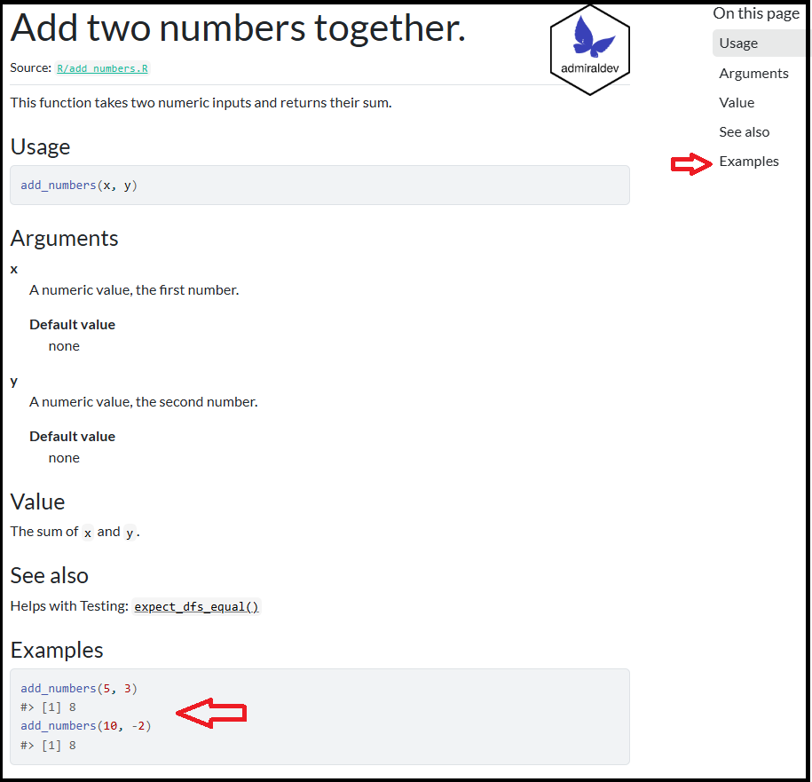
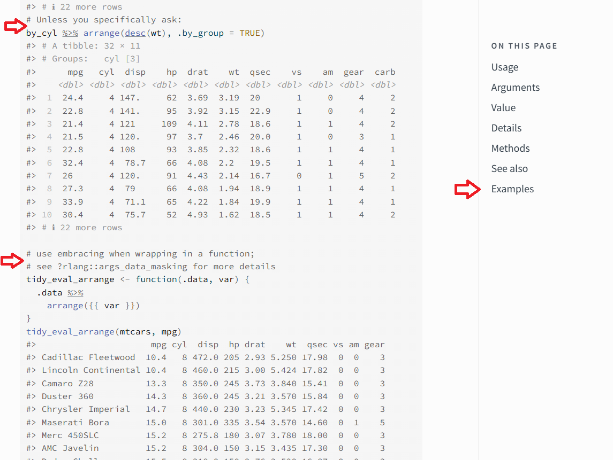
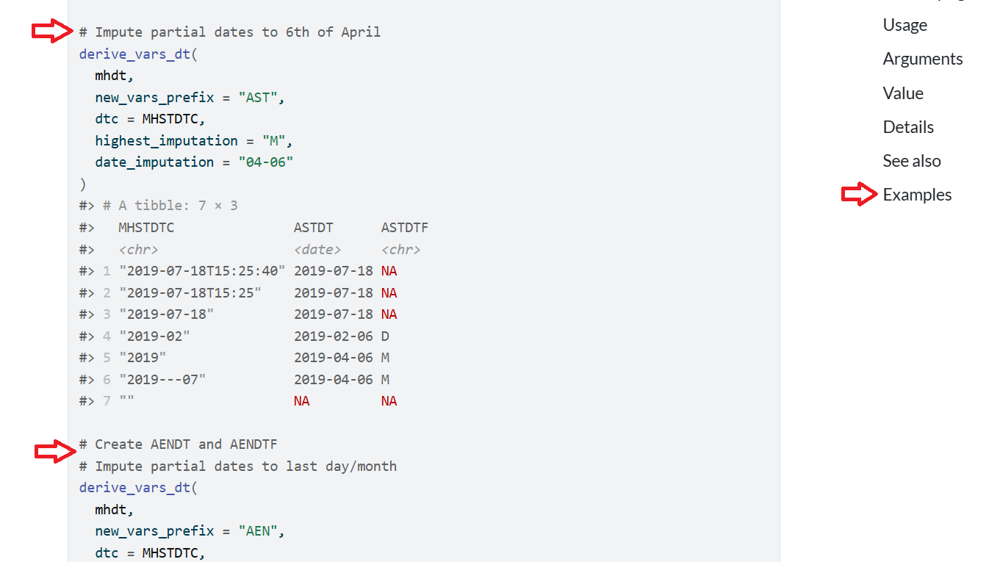
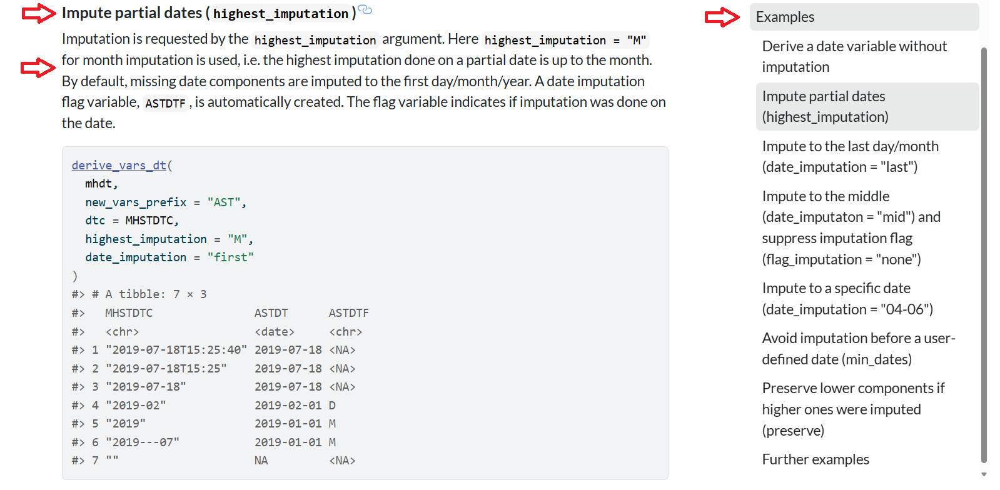

## Required xkcd comic

:::: {.columns}

::: {.column width="40%"}
 
:::

::: {.column width="60%"}
::: {.incremental}
* Do you read the manual first?  
* Do you just dive in and read the manual afterwards?  
* I am a dive in and then read the manual later.  
:::
:::

::::

## The next 20 minutes...

* Brief intro to the problem. Hint: documentation
* Infrastructure behind R package documentation
* `{admiral}` R package and its documentation
* How `{admiral}` used `{roxygen2}` extension abilities to solve its problem

## So at the end of 20 minutes...

I hope you walk away with:

* How R documentation is created.
* How admiral enhanced its documentation to help its users.
* Better documentation means users are happy but also also AI/LLMs to easier understand
and harvest information from your R package.

## What is the `admiral` R package?

* To provide an open source, modularized toolbox that enables the pharmaceutical programming community to develop ADaM datasets in R.

* The package is available from CRAN and can be installed with:
`install.packages("admiral")`

* Users guides for doing BDS, OCCDS, TTE, ADSL, ICE, Date/Times and more available.

* A sea of documentation!!

## Introduction: A Sea Documentation {.smaller}

- Detailed argument definitions and inline examples aid understanding complex functions.
- In `{admiral}`, top-notch documentation is a priority.
- **Problem**: As number of functions and complexity of functions grew, documentation became unwieldy and hard to navigate.
- **Solution**: Extended `{roxygen2}` package's `roclets` to better display and curate examples.
- This presentation explores the technical details and positive impact on `{admiral}`'s function examples.

## R Packages: The Foundation of the R Ecosystem {.smaller}

- R packages bundle code, data, documentation, and tests in a standardized format.
- They facilitate code sharing and reuse, expanding R's functionality.
- **Key components**:
    - R functions in `R/` directory. Documentation in `man/`
    - Documentation using `roxygen2` comments in `.R` produce the `.Rd` files.
    - Few other folders and needed files - Check out: [https://r-pkgs.org/](https://r-pkgs.org/)
    - 

## `roxygen2`: Streamlining R Docs {.smaller}

- The `roxygen2` R package simplifies documentation within R packages.
- Developers write documentation directly alongside function definitions using `#'` comments.
- **Benefits**:
    - Keeps code and documentation co-located, making updates efficient.
    - Automatically generates `.Rd` files (standard R documentation) from comments.
- This system significantly reduces effort, enhancing user understanding of functions.
- Check out: [https://roxygen2.r-lib.org/](https://roxygen2.r-lib.org/)
  

## Roxygen in an `.R` file

Here's a brief example of a function `add_numbers()` with its roxygen documentation:

```{r}
#| echo: TRUE
#| code-line-numbers: "1-13|1|2|3|4|5|6|7|8|9|10|11-13"
#' Add two numbers together.
#'
#' This function takes two numeric inputs and returns their sum.
#'
#' @param x A numeric value, the first number.
#' @param y A numeric value, the second number.
#' @return The sum of `x` and `y`.
#' @examples
#' add_numbers(5, 3)
#' add_numbers(10, -2)
add_numbers <- function(x, y) {
  x + y
}
```

## Documentation Structure - `.Rd`

```{r, eval = FALSE}
#| echo: TRUE
#| code-line-numbers: "1-31|5|10-13|16-19|25-27|28-31"
% Generated by roxygen2: do not edit by hand
% Please edit documentation in R/add_numbers.R
\name{add_numbers}
\alias{add_numbers}
\title{Add two numbers together.}
\usage{
add_numbers(x, y)
}
\arguments{
\item{x}{A numeric value, the first number.

\describe{
\item{Default value}{none}
}}

\item{y}{A numeric value, the second number.

\describe{
\item{Default value}{none}
}}
}
\value{
The sum of \code{x} and \code{y}.
}
\description{
This function takes two numeric inputs and returns their sum.
}
\examples{
add_numbers(5, 3)
add_numbers(10, -2)
}
```


## Don't touch!

{width="400px"}

* I do not recommend editing these by hand - ever - unless you want pain!

## Let's recap!

::: {.incremental}
  * 📝 Write R code in `.R` files
  * ✍️ Add `#'` roxygen comments above functions objects
  * 🏷️ Use roxygen tags `@param`, `@return`, `@examples`, etc:
  * ▶️ Run `devtools::document()` or Ctrl/Cmd + Shift + D
  * ⚙️ `{roxygen2}`processes `.R` files extracts comments & tags
  * 📄 `.Rd` files auto-generated in `man/` directory
  * 📚 R help system displays documentation to users
:::


## Render in R help file and pkgdown

::: {.r-stack}

{.fragment width="650" height="400"}

{.fragment width="500" height="450"}
:::


# `{dplyr}` - a package to follow!

## `{dplyr}`

:::: {.columns}

::: {.column width="60%"}

:::

::: {.column width="40%"}
* #'s used to delineate new example with explanation
* Creates a sea of examples
* Examples are not navigable on right hand side 
    
:::

::::

# `{admiral}` - following in the footsteps

## `{admiral}` 1.2.0

:::: {.columns}

::: {.column width="60%"}

:::

::: {.column width="40%"}
* #'s used to delineate new example with explanation
* Creates a sea of examples
* Examples are not navigable on right hand side 
    
:::

::::


## `{admiral}` 1.3.0

:::: {.columns}

::: {.column width="60%"}

:::

::: {.column width="40%"}
* A nice linkable title
* Description of example 
* Right hand side has navigable example
:::

::::

## How was this done?

:::: {.columns}

::: {.column width="60%"}
{width="295px"}
:::

::: {.column width="40%"}
* `{roxygen2}` allows for extensions 
* `{admiraldev}` houses the functions in `roclet_rdx.R` to allow for extensions
    
:::

::::


## Extending the roclet

```{r}
#| echo: TRUE
#| code-line-numbers: "1-20|1-11|12|13|14|15|16|17|18|19|20|21"
#' A Demo Function
#'
#' This function is used to demonstrate the custom tags of the `rdx_roclet()`.
#'
#' @param x An argument
#' @param number A number
#' @permitted A number
#' @param letter A letter
#' @permitted [char_scalar]
#' @default The first letter of the alphabet
#' @keywords internal
#' @examplesx
#' @info This is the introduction.
#' @caption A simple example
#' @info This is a simple example showing the default behaviour.
#' @code demo_fun(1)
#' @caption An example with a different letter
#' @info This example shows that the `letter` argument does not
#'   affect the output.
#' @code demo_fun(1, letter = "b")
demo_fun <- function(x, number = 1, letter = "a") 42
```

## Eck! A small subset of the `.Rd`

```{text}
#| echo: TRUE
#| code-line-numbers: "5|13|15|16|18|20-21|22|24|26-27"
% Generated by roxygen2: do not edit by hand
% Please edit documentation in R/demo_fun.R
\name{demo_fun}
\alias{demo_fun}
\title{A Demo Function}
\usage{
demo_fun(x, number = 1, letter = "a")
}

...

\keyword{internal}
\section{Examples}{

This is the introduction.
\subsection{A simple example}{

This is a simple example showing the default behaviour.

\if{html}{\out{<div class="sourceCode r">}}\preformatted{demo_fun(1)
#> [1] 42}\if{html}{\out{</div>}}}
\subsection{An example with a different letter}{

This example shows that the \code{letter} argument does not affect the output.

\if{html}{\out{<div class="sourceCode r">}}\preformatted{demo_fun(1, letter = "b")
#> [1] 42}\if{html}{\out{</div>}}}}


```

## Technical Takeaway

* New Tags on the Block:
  * `@examplesx`
  * `@caption`
  * `@info`
  * `@code`
* Get into the purpose, how it works and the processing (briefly!!)

## @examplesx - The Examples Section {.smaller}

**Purpose:** Marks the beginning of the entire examples section in Roxygen documentation, serving as a structural tag.

**How it Works:** Signals the `transform_examplesx()` function to start processing custom Roxygen tags for examples.

**Processing:** The `transform_examplesx()` function orchestrates the grouping of @caption, @info, and @code tags. It executes R code from @code, captures output, handles expected conditions, and combines these into a cohesive `examplex` tag. It also cleanses output of problematic Unicode characters to prevent LaTeX errors.

## @caption - Example Title {.smaller}

**Purpose:** Provides a descriptive title or caption for an individual example within the examples section.

**How it Works:** Each @caption tag initiates a new example block, with the text following it becoming the title.

**Processing:** The `transform_examplesx()` function collects the caption text. In the final .Rd documentation output, this caption is formatted as a `\subsection{}` within the main `\section{Examples}{}`.

## @info - Example Description {.smaller}

**Purpose:** Offers additional descriptive text or context for an example, explaining its demonstration or specific considerations.

**How it Works:** It is placed after an `@caption` and before an `@code` tag, containing explanatory text for that specific example.

**Processing:** The `transform_examplesx()` function appends this descriptive text to the current example block's contents, integrating it into the overall example documentation.

##  @code - Executable Example Code {.smaller}

**Purpose:** Provides the actual R code for an example, which is executed during the R package check, and its output is included in the documentation.

**How it Works:** The R code follows the `@code` tag. It can include an optional `[expected_cnds = "warning"]` argument to specify anticipated conditions like warnings or errors without causing check failures.

**Processing:** `transform_examplesx()` extracts the code and any `expected_cnds` options, then calls `execute_example()`. This function runs the code in a controlled environment, captures console output, messages, warnings, and errors. Unexpected conditions (not listed in `expected_cnds`) lead to an error and an R CMD check failure, ensuring examples are functional and correct. The captured code and its output are then formatted and integrated into the example's contents.

## Conclusion {.smaller}

* The admiral R package faced challenges with unwieldy function documentation due to complex and numerous examples.

* To address this, admiral extended roxygen2's roclets by introducing custom Roxygen tags: `@examplesx`, `@caption`, `@info`, and `@code`.

* These custom tags enable a structured, user-friendly presentation of examples, providing scaffolding for complex function usage.

* This innovation significantly improved the overall user experience and the quality of admiral's function documentation.

* In this age of AI - high quality documentation will be key to a software products long-term usefulness.

## Question

What is the name of the documentation package that could be extended to address admiral's needs?

## Resources

:::: {.columns}

::: {.column width="19%"}
**R Packages**


:::

::: {.column width="19%"}
**roxygen2**


:::

::: {.column width="19%"}
**dplyr arrange()**


:::

::: {.column width="19%"}
**admiral**


:::

::: {.column width="19%"}
**admiraldev roclet_rdx.R**


:::

::::
